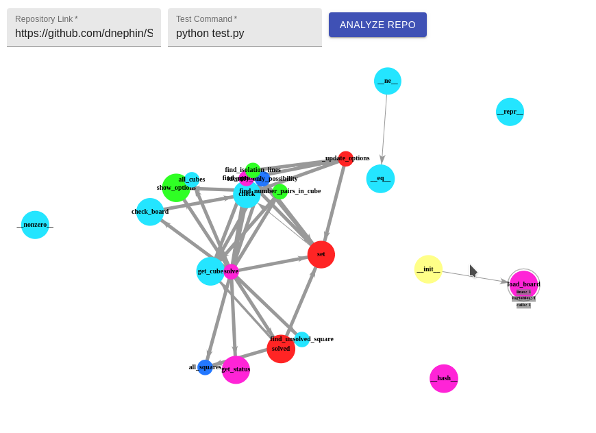
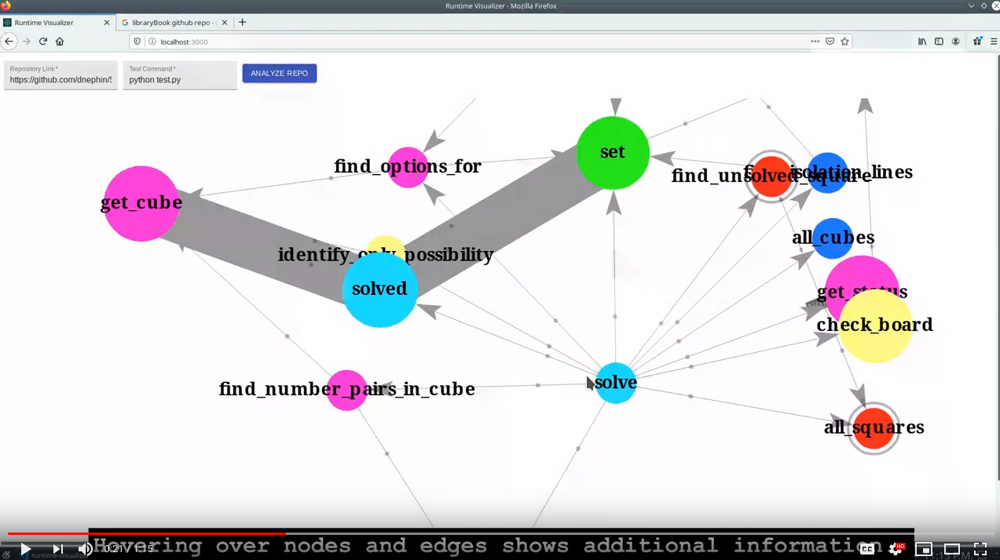

# runtime-visualizer
A visualizer for analyzing Python code.

## Preview
Enter a Python project repository and the command to execute tests, then voila!


## Design Video
[](https://www.youtube.com/watch?v=zkbQfQ-w3ts)

## Visualization Description
1. Our visualization was implemented using react-force-graph-2d
    * On top of this, we created customized rendering for node, and link metadata to display as an overlay
    * To prevent clutter, we only display data on hover
        * The hovered node and its children are highlighted and their metadata is displayed

## Analysis Description
1. Runtime Analysis
    * Instead of using built-in Python libraries to grab the data, we made our own Python class to store our call information. 
    * We injected code that would call this library after before/after every call. 
    * Each test will also have a call injection to create a new instance of our analyze class
    * Data from this analysis is represented by edge width

2. Memory Analysis
    * We used a Python library mem_profile and inject profiles to each function def in all files
    * Then, we execute the unit tests and parse the log file and track peak memory usage for every function call
    * Data from this analysis is represented by the size of the nodes

## Group members & Work Contributed
1. Johnson Vu
    * Visualization
    * Front & Back-end configuration
    * General application data workflow/pipelining
    * Memory analysis code injection

2. Justin Kwan
    * Call graph generation
    * Run-time injection and analysis
    * Back-end configuration
3. Leon Lui
    * Run-time injection and analysis
        * Create data structure to keep track of function calls
    * Example code mock-up
4. MengXin Zhao
5. Varun Belani
    * Memory analysis
    * Project video

## Running the application
First install `docker` and `docker-compose`

Now run the following command in the main project directory:
```
$ sudo docker-compose up
```


