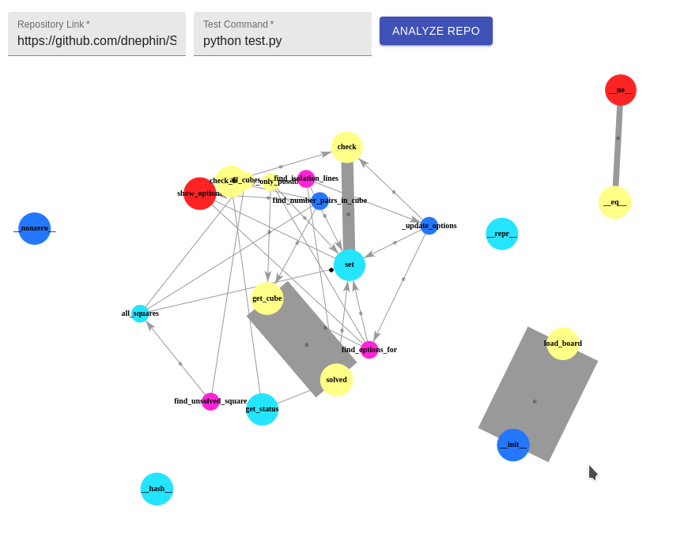

# runtime-visualizer
A visualizer for analyzing Python code.

## Visualizer
Enter a Python project repository and the command to execute tests, then voila!


## Group members & Work Contributed
1. Johnson Vu
    * Visualization
    * Front & Back-end configuration
    * General application data workflow/pipelining
    * Memory analysis code injection

2. Justin Kwan
    * Call graph generation
    * Run-time injection and analysis
    * Back-end configuration
3. Leon Lui
    * Run-time injection and analysis
        * Create data structure to keep track of function calls
    * Example code mock-up
4. MengXin Zhao
5. Varun Belani
    * Memory analysis
    * Project video

## Running the application
First install `docker` and `docker-compose`

Now run the following command in the main project directory:
```
$ sudo docker-compose up
```

## Analysis Description
Runtime Analysis
    * Instead of using build in python librarys to grab the data, we made our own python class to store our call information. We injected code that would call this libary after before/after every call. From the information gather by this class, we can then parse the output data file and create our visualization. Each test will also have a call injection to create a new instance of our analyize class
